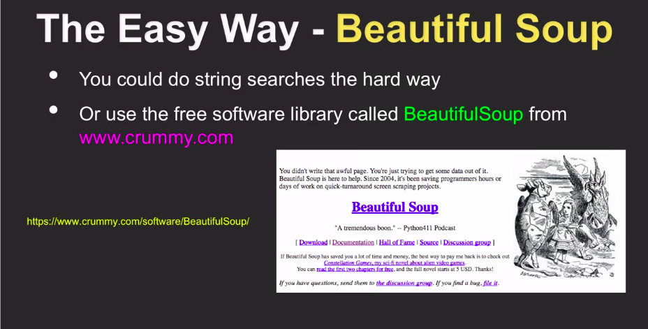

# Parsing Web Page
- here we are going to learn how to parse the html tag by using the library of [BeautifulSoup](https://www.crummy.com/software/BeautifulSoup/bs4/doc/)

- .contents[0] return the content of tags