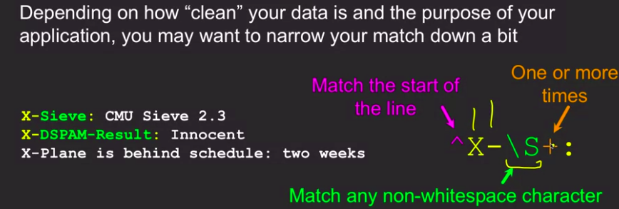

## Regular Exprresion

- Regular expression is pattern to used the mathing of characters.

#### Library of Regular Expression in python
- import re     // re is the library of regular expression.

### Some syntax of RE

#### some method of "re" library
- search
  1. re.search()    // search method work like find() if you find any word or pattern then we can use search.
- findall()
  1. to find all string which has match to the RE.

  ### Example of search method

  
  

<h3>Match Example </h3>
  
  

<h2> Greedy match </h2>

## Non Greedy Match
- Use +? or *? operator for non greedy match. It will choose shorter string.

## None blank Character Syntax
- [^ ] using this syntax regex return the non blank character.
- It serach untill blank character comes.
